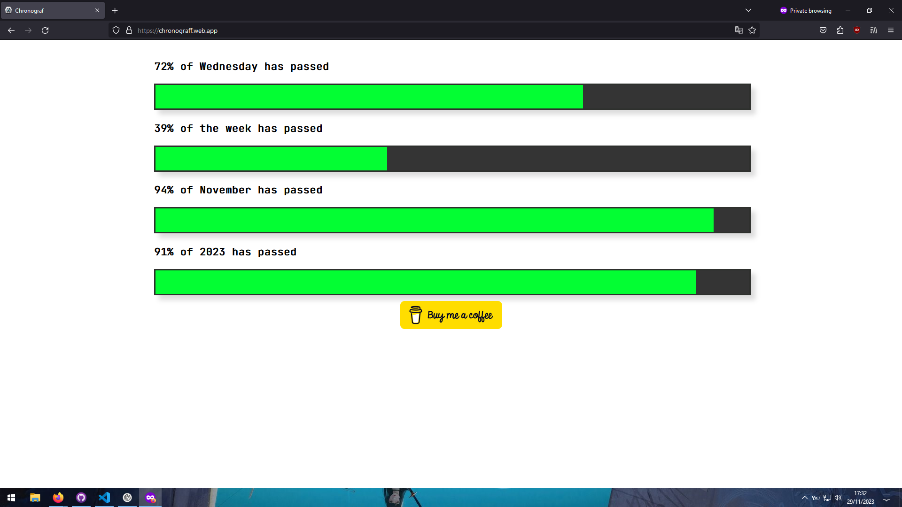

# Chronograf WebApp

Welcome to Chronograf, a web application that visualizes time as progress bars displaying the percentage of time remaining. This repository contains the code for the Chronograf web application.

## Features

- Displays time as percentage progress bars.
- Visually represents how much time is left.
- Built using HTML, CSS, and JavaScript.
- Cross-platform compilation using Apache Cordova.
- Utilizes the JetBrainsMono font for improved readability.

## Demo

You can access the app [here](https://chronograff.web.app/).

## Usage

- Upon opening the application, you'll see time represented as progress bars.
- The bars visually indicate the percentage of time elapsed and remaining.

## Technologies Used

- HTML
- CSS
- JavaScript
- Apache Cordova (for cross-platform compilation)
- JetBrainsMono font

## Contributing

If you'd like to contribute to Chronograf, feel free to open an issue or submit a pull request on [GitHub](https://github.com/munabedan/chronograf).

## Support

For any questions or issues, please [open an issue](https://github.com/munabedan/chronograf/issues) on GitHub.

## License

This project is licensed under the [Apache License 2.0](http://www.apache.org/licenses/LICENSE-2.0).

---

Thank you for using Chronograf! Feel free to explore the codebase and make it your own. If you have any suggestions or improvements, don't hesitate to contribute!